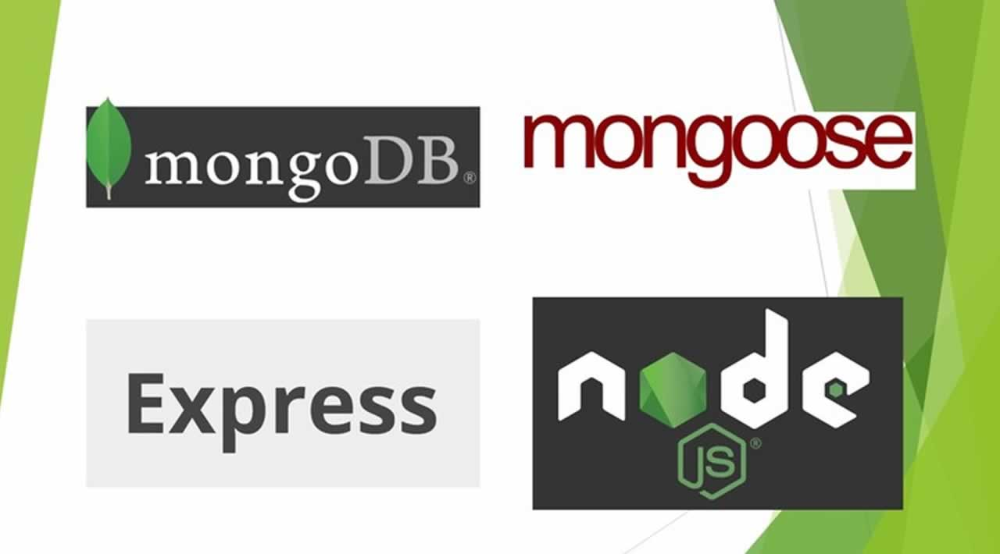

# BACKEND WITH NODE EXPRESS AND MONGODB

This codebase was created to demontrate an example of a backend service implemented using nodeJs , express and mongoDB

## Getting started

```
# hier are the steps to run the code on your desktop


```

## Code Overview

### Folder structure

```

```

## Docs

## Todo
