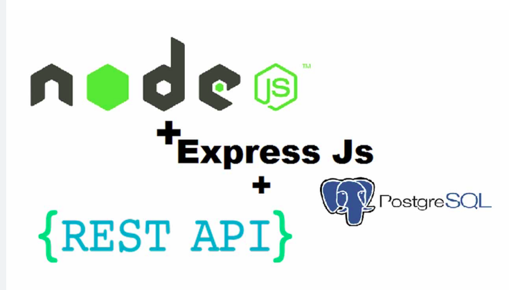

# BACKEND WITH NODE EXPRESS AND MONGODB

Small backend application to demonstrate how to use nodejs , express and postgresql to build a small server that implement authentication and authorization and also CRUD Operations.

## Getting started

```
# hier are the steps to run the code on your desktop

$ git clone https://github.com/dtn1999/node-express-mongodb.git

$ cd node-exporess.mongodb

$ npm install

$ npm run:dev
```

## Code Overview

### Folder structure

```
root
   | frontend
   | backend 
           | controllers
                       | product.js
                       | user.js
           | middlewares
                       | auth.js
                       | multer-config.js
           | models
                  | Product.js
                  | User.js
           | routes 
                  | product.js
                  | user.js
    app.js
    server.js

             
```

## Docs

jwt,
bcrypt,
mongoose

## Todo

[x] jwt authentication
[]  fix bug with .env 
[]  implement frontend (in react and react native :heart_eyes:)
[]  inplement the graphql version of the server